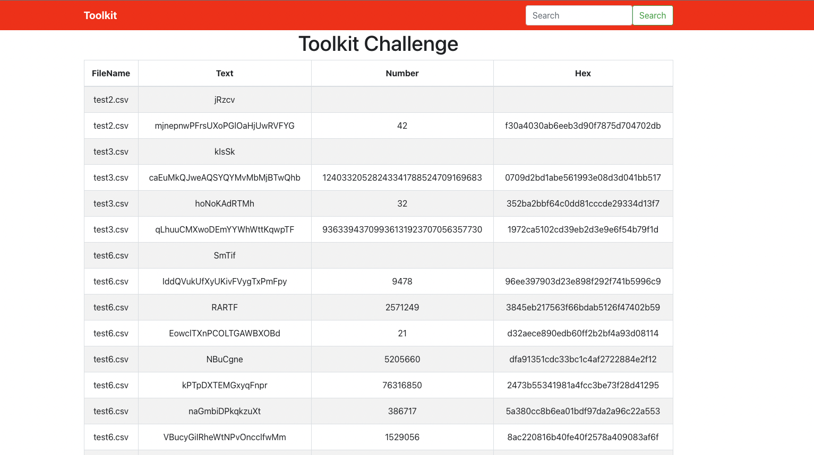

# Code Challenge

## **Iniciar Aplicación**

Para iniciar la aplicación con docker compose se escribe el siguiente comando en consola en el directorio del proyecto

```docker
docker-compose up
```

Al terminar de construir las imagenes se accede al navegador con la url *[http://localhost:3000/](http://localhost:3000/)*



Al iniciar la aplicación encontramos la tabla con la información, esta información es consultada a la API construida donde lo primero que hace la función es consultar los nombres de los archivos, luego consulta individualmente la información según el nombre del archivo y luego esta información se concatena al objeto que se devuelve al final.

(Adicional) En la parte superior encontramos un buscador que nos permite filtrar por medio del nombre del archivo. Este parametro es enviado y procesado para filtrar y devolver solamente los objetos relacionados al texto ingresado.

## **Entorno de Desarrollo**

### **Backend**

Para correr el proyecto en un entorno de desarrollo por primera vez se deben seguir los siguientes pasos.

- Ir a la carpeta `backend`
- Installar los paquetes con el comando `npm install`
- Correr la aplicación con el comando `npm run dev`
- Si se desea correr las pruebas unitarias, se corren con el comando `npm run test` (Opcional)

## **Entorno de Producción**

Para correr el proyecto para el entorno de producción o mediante Docker y Docker-Compose se deben seguir los siguientes pasos.

- Ir a la carpeta `frontend`
- Generar el build de la aplicación con el comando `npm run build`
- Ir a la raíz del repositorio
- Correr el comando `docker-compose up --build -d`

## **Consideraciones**

- El puerto utilizado para la API es el 3000.
- El puerto utilizado para el entorno de desarrollo de React puede ser cualquiera a excepción del 3000.
- El puerto de exposición de la página web en el entorno de producción es el 80.

## Frontend

### Tecnologias utilizadas 🚀

- [Node](https://nodejs.org/en/)
- [React](https://es.reactjs.org/)
- [React-Bootstrap](https://react-bootstrap.github.io/)
- [Bootstrap-CDN](https://getbootstrap.com/docs/5.0/getting-started/introduction/)
- [Jest](https://jestjs.io/docs/getting-started)
- [enzyme](https://enzymejs.github.io/enzyme/)

### TESTS 🧪

La apliación cuenta con un archivo app.test.js que realiza un snapshot del componente para permitir ver los cambios realizados y que el flujo del componente se siga manteniendo.

    `cd front
    npm install
    npm run test`

### Dockerfile 🐳

Para construir la imagen de la aplicación en react, se utiliza *node:12* y *nginx:alpine* .


Se crea un entorno para enviarla al archivo nginx.conf. la imagen queda expuesta en el puerto 3000

    `
    FROM nginx:alpine
    EXPOSE 80
    COPY nginx.conf /etc/nginx/nginx.conf
    COPY build/ /usr/share/nginx/html
    `
    `

---
